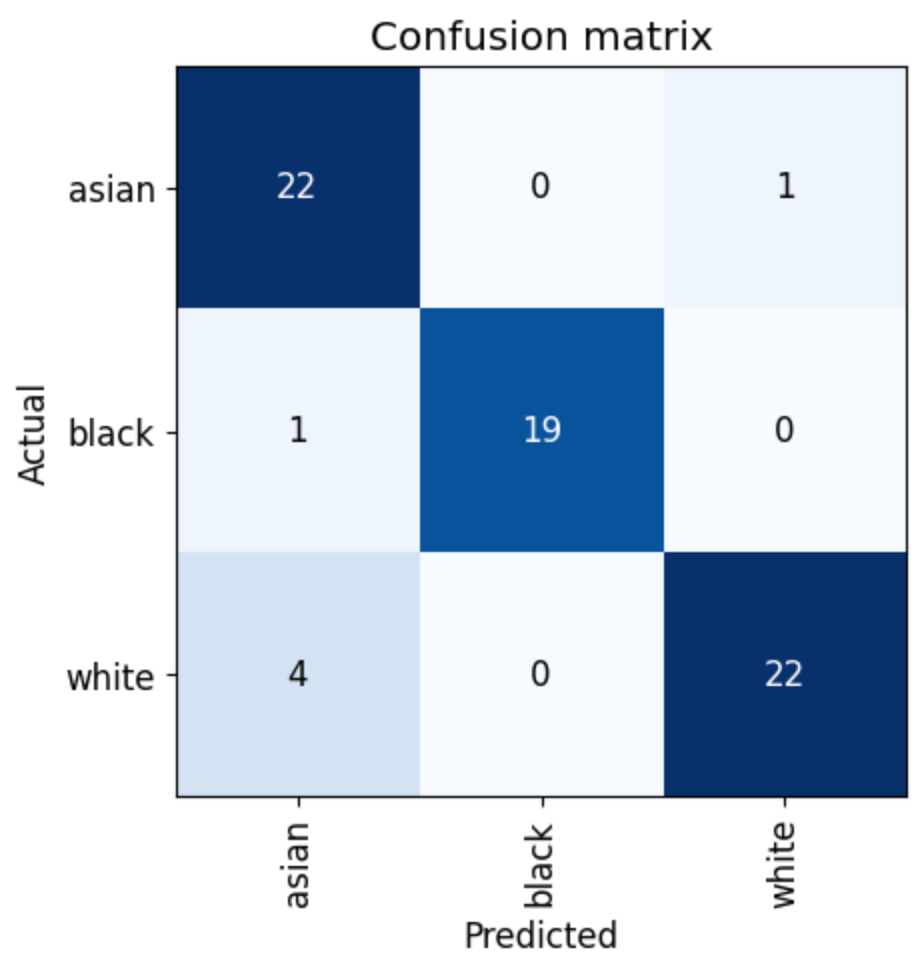

[fastbook](https://github.com/fastai/fastbook) chapter 2 based racial features detection model working over fastapi example

## why

Result project that I've got while studying Chapter 2 of [fastbook](https://github.com/fastai/fastbook). Decided to create this type of model because Azure services (along with online jupyter notebook serving ones) are disabled in my country and found a repo with [thispersondoesnotexist](https://thispersondoesnotexist.com/) outputs (thanks to https://github.com/BillPlayzToday/HumanFaces)

## info

`vision_learner` with `resnet18`

### Dataset

| feature | Images |
| ------- | ------ |
| white   | 137    |
| black   | 99     |
| asian   | 113    |

