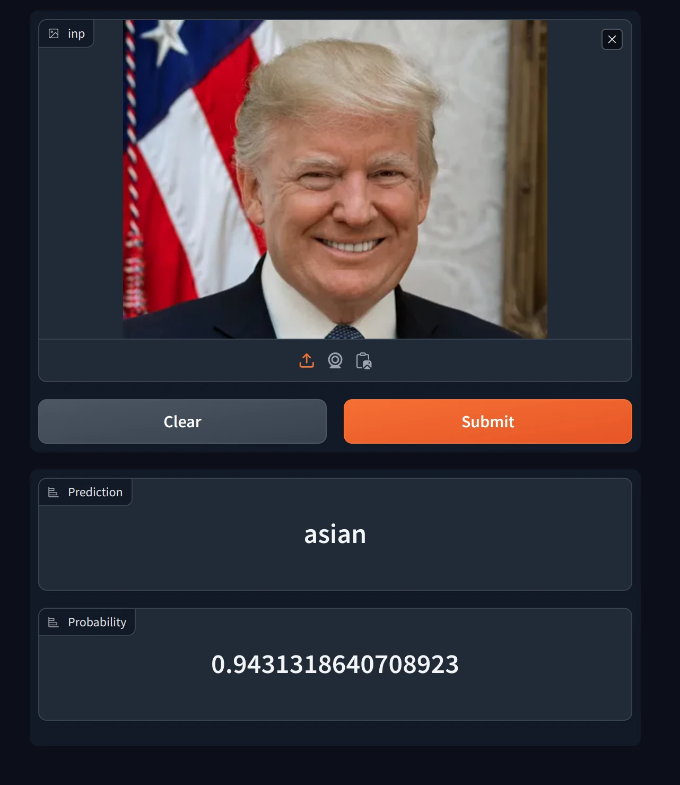

## why

Result project that I've got while studying Chapter 2 of [fastbook](https://github.com/fastai/fastbook)

## info

`vision_learner` with `resnet18`

### Dataset

https://github.com/BillPlayzToday/HumanFaces

| feature | Images |
| ------- | ------ |
| white   | 137    |
| black   | 99     |
| asian   | 113    |
